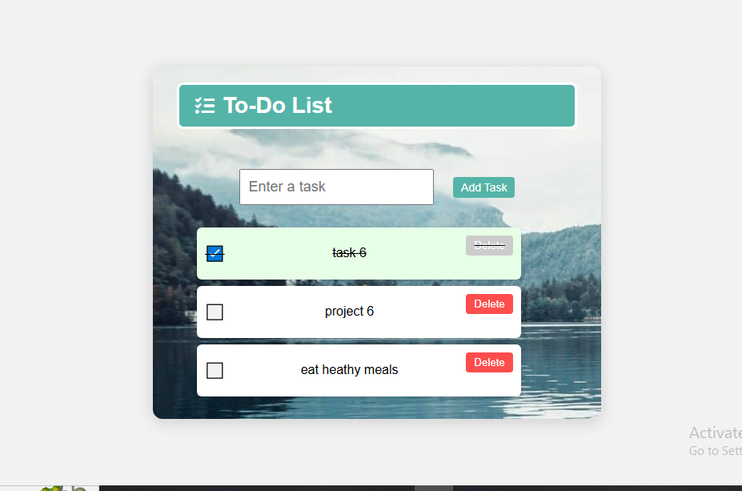

# 📝 To-Do List 

## 📌 Description
A simple JavaScript-based to-do list app that allows users to add, delete, and mark tasks as done — with persistent storage using localStorage.

---
## 📸 Preview

  

## 🎯 Features
1- **Add Tasks – Type a task and add it to your list.**

2- **Mark as Done – Click the checkbox icon to toggle completion.**

3- **Delete Tasks – Remove tasks from the list (disabled for completed tasks).**

4- **Persistent Storage – Tasks are saved in the browser’s localStorage so they remain after page refresh.**

# 🛠 Technologies Used

- **HTML5 – Structure**

- **CSS3 – Styling & layout**

- **JavaScript (ES6) – Functionality & DOM manipulation**

- **localStorage – Data persistence**

# 🚀 How to Use

- **Open index.html in your browser.**

- **Type a task in the input field and click Add.**

- **Click on the checkbox icon to mark tasks as done.**

- **Click Delete to remove tasks (only available for unfinished tasks).**

- **Refresh the page — tasks will remain saved.**