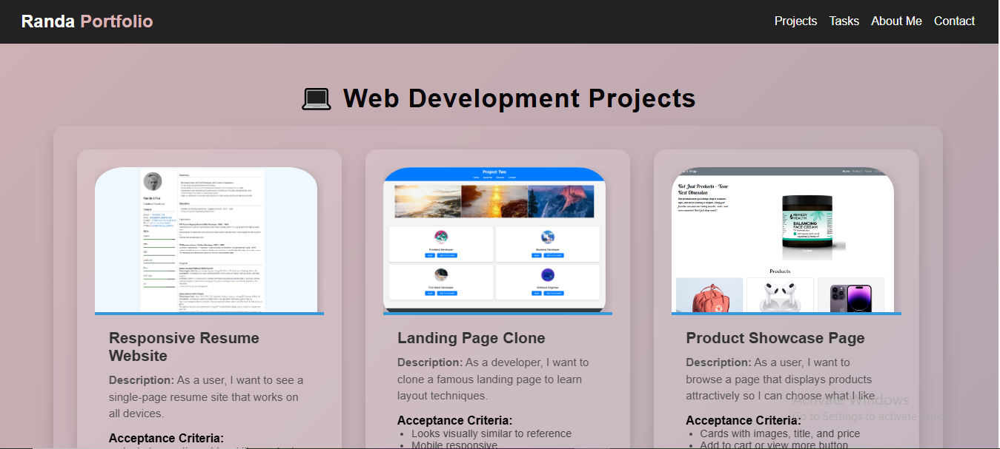

## Portfolio Website
---
A modern, responsive personal portfolio website built with **HTML**, **CSS**, and **JavaScript**.  
It showcases projects, skills, and contact information with smooth animations and a professional design.  
The site is deployed on **Vercel** and accessible via a live link.

---

## Live Demo
[View Live Site](https://vercel-seven-snowy-49.vercel.app/)  

---

## Features
- Responsive design for mobile, tablet, and desktop.
- Smooth scroll animations when sections appear.
- Projects and tasks displayed in an elegant card layout.
- Modern UI inspired by professional portfolio templates.
- Contact form integration (if enabled).

---
## 📸 Preview

  

### Push Project to GitHub 
```bash
git clone https://github.com/username/portfolio-website
cd portfolio-website
git status
git add -A
git status
git commit -m "Initial commit"
git push origin main
