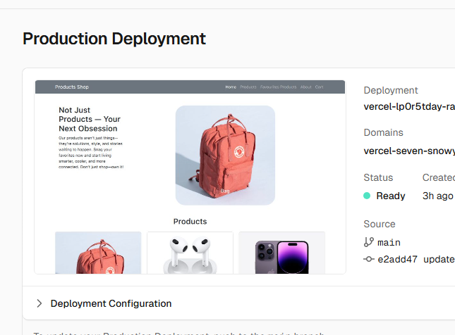

## Products Webpage
---
- A simple, responsive products webpage built with HTML, CSS, and JavaScript.  
- The site is deployed on **Vercel** and accessible via a live link.

---

## Live Demo
[View Live Site](https://vercel-seven-snowy-49.vercel.app/)

### Push Project to GitHub 
-bash

- git clone https://github.com/username/name-of-repo
- cd products-webpage
- git status
- git add -A
- git status
- git commit -m "Initial commit"
- git push origin main

## 📸 Preview

  

## Deployment Instructions

- Follow these steps to deploy your project using **Vercel**:

## Deploy on Vercel

1. Go to [Vercel](https://vercel.com)  
2. Log in and click **"New Project"**  
3. Import your GitHub repository  
4. **Framework Preset:** Select **Other**  
5. **Build Command:** Leave empty  
6. Click **Deploy**  

