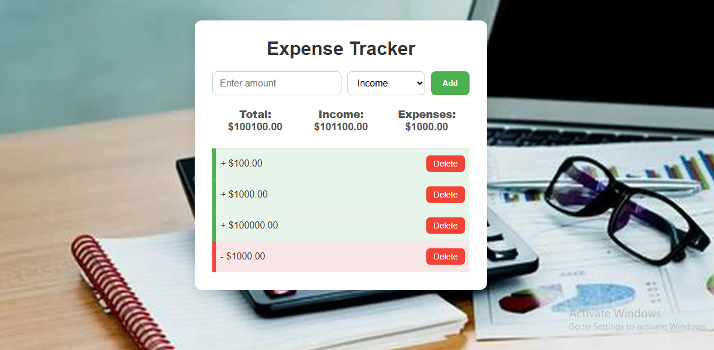

# Expense Tracker

## 📌 Description
A simple web app to track your income and expenses so you can manage your budget efficiently.  
Users can add transactions labeled as income or expense, see a running total balance, and view individual transaction details. All data is saved in the browser's local storage, so it persists after refresh.

---
## 📸 Preview

  

## 🎯 Features
- Add income or expense transactions with amount input  
- View a list of all transactions with delete option  
- Display total income, total expenses, and the current balance  
- Persist data using local storage  
- Responsive and user-friendly interface

---

## 🛠 Technologies Used
- HTML  
- CSS  
- JavaScript (ES6)  
- Local Storage API  

---

## Installation
1. Clone or download the repository.  
2. Open `index.html` in your favorite browser.  

---

# 🚀 How to Use
1. Enter a positive amount in the amount input field.  
2. Select the transaction type (Income or Expense) from the dropdown.  
3. Click the "Add" button to add the transaction to the list.  
4. View the running totals for income, expenses, and balance.  
5. Click "Delete" next to any transaction to remove it.  
6. Data is saved automatically and will be restored on page reload.

---

