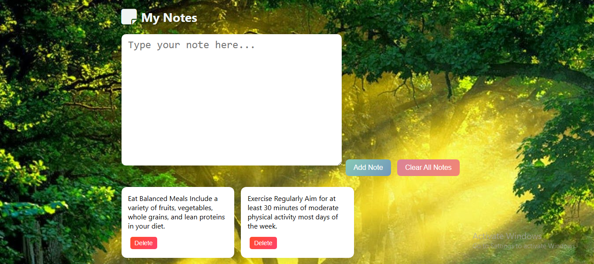

# 📝 Note Application 
## 📌 Description

This is a simple notes app designed to help you keep track of healthy habits and tips. It allows you to add, view, and delete notes about healthy lifestyle choices to encourage wellness in your daily routine.
---

## 📸 Preview

  

## 🎯 Features

1- **Add notes related to habits and tips.**

1- **Display notes in a clean, user-friendly interface.**

1- **Delete individual notes when they are no longer needed.**

1- **Clear all notes with one click.**

1- **Notes are saved in browser local storage to persist between sessions.**

# 🛠 Technologies Used

- **HTML5**

- **CSS3**

- **JavaScript (ES6)**

- **Local Storage for data persistence**

# 🚀 How to Use
- **Type your healthy note or tip in the input area.**

- **Click the "Add Note" button to save it.**

- **View all your saved notes below the input area.**

- **Delete individual notes using the delete button below each note.**

- **Use "Clear All Notes" to remove all notes at once.**

